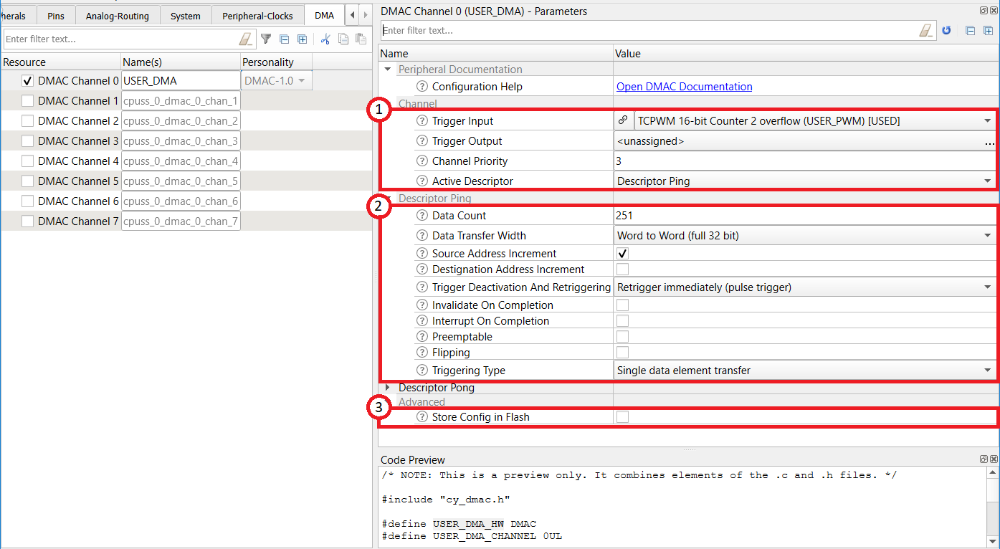
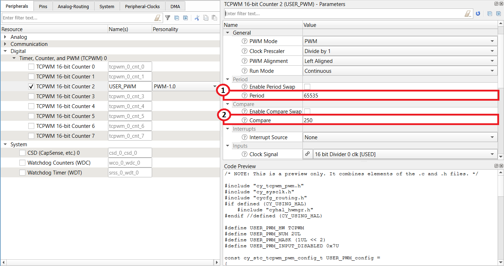
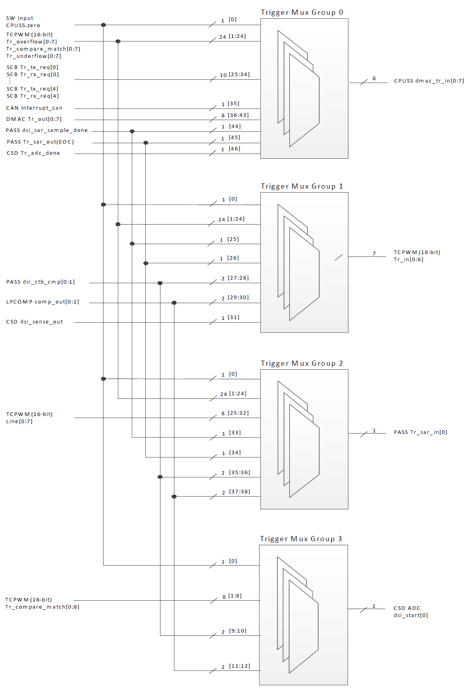

# PSoC 4: PWM Triggering a DMA Channel

This example demonstrates how to route trigger signals on a PSoC 4 device.The trigger signal, in this code example, is routed from the PWM to the DMA, using Device Configurator.

[Provide feedback on this Code Example.](https://cypress.co1.qualtrics.com/jfe/form/SV_1NTns53sK2yiljn?Q_EED=eyJVbmlxdWUgRG9jIElkIjoiQ0UyMzE3MzIiLCJTcGVjIE51bWJlciI6IjAwMi0zMTczMiIsIkRvYyBUaXRsZSI6IlBTb0MgNDogUFdNIFRyaWdnZXJpbmcgYSBETUEgQ2hhbm5lbCIsInJpZCI6InZzcnMiLCJEb2MgdmVyc2lvbiI6IjEuMC4wIiwiRG9jIExhbmd1YWdlIjoiRW5nbGlzaCIsIkRvYyBEaXZpc2lvbiI6Ik1DRCIsIkRvYyBCVSI6IklDVyIsIkRvYyBGYW1pbHkiOiJQU09DIn0=)

## Requirements

- [ModusToolbox® software](https://www.cypress.com/products/modustoolbox-software-environment) v2.2

    **Note:** This code example version requires ModusToolbox software version 2.2 or later and is not backward compatible with v2.1 or older versions.

- Board Support Package (BSP) minimum required version: 1.0.0
- Programming Language: C
- Associated Parts: [PSoC 4100S Plus](https://www.cypress.com/documentation/datasheets/psoc-4-psoc-4100s-plus-datasheet-programmable-system-chip-psoc)

## Supported Toolchains (make variable 'TOOLCHAIN')

- GNU Arm® Embedded Compiler v9.3.1 (`GCC_ARM`) - Default value of `TOOLCHAIN`
- Arm compiler v6.11 (`ARM`)
- IAR C/C++ compiler v8.42.2 (`IAR`)

## Supported Kits (make variable 'TARGET')

- [PSoC 4100S Plus Prototyping Kit](https://www.cypress.com/CY8CKIT-149) (`CY8CKIT-149`) - Default value of `TARGET`

## Hardware Setup

This example uses the board's default configuration. See the kit user guide to ensure that the board is configured correctly.

**Note:** PSoC 4 Kits ship with KitProg2 installed. ModusToolbox software requires KitProg3. Before using this code example, make sure that the board is upgraded to KitProg3. The tool and instructions are available in the [Firmware Loader](https://github.com/cypresssemiconductorco/Firmware-loader) GitHub repository. If you do not upgrade, you will see an error like "unable to find CMSIS-DAP device" or "KitProg firmware is out of date".

## Using the Code Example

### In Eclipse IDE for ModusToolbox:

1. Click the **New Application** link in the **Quick Panel** (or, use **File** > **New** > **ModusToolbox Application**). This launches the [Project Creator](http://www.cypress.com/ModusToolboxProjectCreator) tool.

2. Pick a kit supported by the code example from the list shown in the **Project Creator - Choose Board Support Package (BSP)** dialog.

   When you select a supported kit, the example is reconfigured automatically to work with the kit. To work with a different supported kit later, use the [Library Manager](https://www.cypress.com/ModusToolboxLibraryManager) to choose the BSP for the supported kit. You can use the Library Manager to select or update the BSP and firmware libraries used in this application. To access the Library Manager, click the link from the Quick Panel.

   You can also just start the application creation process again and select a different kit.

   If you want to use the application for a kit not listed here, you may need to update the source files. If the kit does not have the required resources, the application may not work.

3. In the **Project Creator - Select Application** dialog, choose the example by enabling the checkbox.

4. Optionally, change the suggested **New Application Name**.

5. Enter the local path in the **Application(s) Root Path** field to indicate where the application needs to be created.

   Applications that can share libraries can be placed in the same root path.

6. Click **Create** to complete the application creation process.

For more details, see the [Eclipse IDE for ModusToolbox User Guide](https://www.cypress.com/MTBEclipseIDEUserGuide) (locally available at *{ModusToolbox install directory}/ide_{version}/docs/mt_ide_user_guide.pdf*).

### In Command-line Interface (CLI):

ModusToolbox provides the Project Creator as both a GUI tool and a command line tool to easily create one or more ModusToolbox applications. See the "Project Creator Tools" section of the [ModusToolbox User Guide](https://www.cypress.com/ModusToolboxUserGuide) for more details.

Alternatively, you can manually create the application using the following steps:

1. Download and unzip this repository onto your local machine, or clone the repository.

2. Open a CLI terminal and navigate to the application folder.

   On Linux and macOS, you can use any terminal application. On Windows, open the **modus-shell** app from the Start menu.

   **Note:** The cloned application contains a default BSP file (*TARGET_xxx.mtb*) in the *deps* folder. Use the [Library Manager](https://www.cypress.com/ModusToolboxLibraryManager) (`make modlibs` command) to select and download a different BSP file, if required. If the selected kit does not have the required resources or is not [supported](#supported-kits-make-variable-target), the application may not work.

3. Import the required libraries by executing the `make getlibs` command.

Various CLI tools include a `-h` option that prints help information to the terminal screen about that tool. For more details, see the [ModusToolbox User Guide](https://www.cypress.com/ModusToolboxUserGuide) (locally available at *{ModusToolbox install directory}/docs_{version}/mtb_user_guide.pdf*).

### In Third-party IDEs:

1. Follow the instructions from the [CLI](#in-command-line-interface-cli) section to create the application, and import the libraries using the `make getlibs` command.

2. Export the application to a supported IDE using the `make <ide>` command.

    For a list of supported IDEs and more details, see the "Exporting to IDEs" section of the [ModusToolbox User Guide](https://www.cypress.com/ModusToolboxUserGuide) (locally available at *{ModusToolbox install directory}/docs_{version}/mtb_user_guide.pdf*.

3. Follow the instructions displayed in the terminal to create or import the application as an IDE project.

## Operation

In this example, the intensity of the LED is controlled by changing the duty cycle of the PWM signal. The PWM duty cycle is updated using DMA. The the duty cycle is updated in such a way that a breathing pattern is seen on the LED.

1. Connect the board to your PC using the provided USB cable through the USB connector.

2. Program the board.

   - **Using Eclipse IDE for ModusToolbox:**

      1. Select the application project in the Project Explorer.

      2. In the **Quick Panel**, scroll down, and click **\<Application Name> Program (KitProg3)**.

   - **Using CLI:**

     From the terminal, execute the `make program` command to build and program the application using the default toolchain to the default target. You can specify a target and toolchain manually:

      ```
      make program TARGET=<BSP> TOOLCHAIN=<toolchain>
      ```

      Example:
      ```
      make program TARGET=CY8CKIT-149 TOOLCHAIN=GCC_ARM
      ```

3. See the breathing output on User LED.

## Debugging

You can debug the example to step through the code. In the IDE, use the **\<Application Name> Debug (KitProg3_MiniProg4)** configuration in the **Quick Panel**. For more details, see the "Program and Debug" section in the [Eclipse IDE for ModusToolbox User Guide](https://www.cypress.com/MTBEclipseIDEUserGuide).

## Design and Implementation

The PSoC 4 device has many digital signals generated from different peripheral blocks. Many of these signals would need to be routed to other peripheral blocks as triggers to some events there. Trigger multiplexers are simple multiplexers that are designed to route these signals from potential source peripherals to destinations. This example demonstrates setting up a trigger route from the PWM to the DMA.

The design implements a PWM that has a duty cycle that is updated on every terminal count of the PWM through a DMA. There is a preset list of compare values in an array. These preset compare values are in a format that, when updated as the compare value of the PWM in every cycle, will generate a breathing pattern. The array with compare values is the source of data transfer for the DMA; the destination is the PWM’s compare register. The DMA is triggered using the PWM’s terminal count signal. The routing of the terminal count signal to the trigger input of the DMA is accomplished using the trigger multiplexer.

You need to connect the PWM overflow trigger (ovrflw) to the DMA input trigger (tr_in). The ModusToolbox Device Configurator  takes care of generating the code responsible for routing the trigger signal. See [Trigger Multiplexer](#trigger-multiplexer)

## Resources and Settings

**Table 1. Application Resources**

| Resource          |  Alias/Object     |    Purpose            |
| :---------------- | :---------------- | :-------------------- |
| TCPWM (PWM)       | USER_PWM         | PWM to drive the user LED |
| DMA               | USER_DMA         | DMA channel to update the PWM compare value |
| GPIO              | CYBSP_USER_LED1   | LED to show the output    |

## Resource Settings

### DMA Configuration

A DMA channel is used to transfer the compare values from the array to the PWM compare register. The configuration is shown in Figure 1.

**Figure 1. DMA Configuration**



1. The trigger input to the DMA is connected to PWM overflow trigger output. Trigger output is not used. Descriptor Ping is retained as the active descriptor.

2. The DMA implements a simple array to single register transfer, which can be achieved by using a single descriptor. Only the ping descriptor is needed in this case. This descriptor transfers a 251- element array to a single compare register over 251 triggers. Therefore, the data count set as 251. Because the data source is an array, the address needs to be incremented after each transfer. Therefore, the source address increment is set. The destination is a constant compare register.Therefore, destination increment is not set.

3. The ping descriptor source and destinations are dynamically updated in the code. Therefore, it is not stored in flash.

### TCPWM Configuration


**Figure 2. TCPWM Configuration**



1. The period value of the PWM is set to 65532. The PWM is clocked by a 12-MHz clock and the terminal count is used
to trigger the DMA. This period value (65532) makes sure that the terminal count and consequently the DMA trigger
occurs at a frequency of 12/65532 MHz. The breathing rate of the LED will be determined by this rate of DMA trigger
multiplied by the number of elements in the array of compare values.

2. The Compare value is set to 256 here. However, the compare value is updated later using this DMA. Therefore, this
value starts the PWM at a very small duty cycle.

## Trigger Multiplexer
The DMA channels can have trigger inputs from different
peripheral sources in the PSoC. This is routed to the individual DMA channel trigger inputs through the trigger multiplexer. In the DMA trigger, multiplexers are organized in trigger groups. Each trigger group is composed of multiple multiplexers feeding into the individual DMA channel trigger
inputs.

The routing of trigger is achieved by configuring  a single trigger group (Trigger group 0), which provides trigger inputs to the DMA.

**Figure 3. Trigger Multiplexer Architecture**



ModusToolbox's Device Configurator automatically generates the code required for trigger multiplexer routing. This trigger multiplexer routing code is in *cycfg_routing.c* as a part of the `cybsp_init()` function. The following code snippet is from the `cybsp_init()` function of this code example; it shows the `Cy_TrigMux_Connect()` call to connect the PWM overflow output trigger to the DMA input trigger.

```c
Cy_TrigMux_Connect(TRIG0_IN_TCPWM_TR_OVERFLOW2, TRIG0_OUT_CPUSS_DMAC_TR_IN0);
```

## Related Resources

| Application Notes                                            |                                                              |
| :----------------------------------------------------------- | :----------------------------------------------------------- |
| [AN79953](https://www.cypress.com/AN79953) – Getting Started with PSoC 4 | Describes PSoC 4 devices and how to build your first application with PSoC Creator |
| **Device Documentation**                                     |                                                              |
| [PSoC 4 Datasheets](https://www.cypress.com/search/all/PSOC%204%20datasheets?sort_by=search_api_relevance&f%5B0%5D=meta_type%3Atechnical_documents) | [PSoC 4 Technical Reference Manuals](https://www.cypress.com/search/all/PSoC%204%20Technical%20Reference%20Manual?sort_by=search_api_relevance&f%5B0%5D=meta_type%3Atechnical_documents) |
| **Code Examples**                                            |                                                              |
| [Using ModusToolbox](https://github.com/cypresssemiconductorco/Code-Examples-for-ModusToolbox-Software) | [Using PSoC Creator](https://www.cypress.com/documentation/code-examples/psoc-345-code-examples) |
| **Development Kits**  | Buy at www.cypress.com |
|[CY8CKIT-149](https://www.cypress.com/CY8CKIT-149) | PSoC® 4100S Plus Prototyping Kit |
| **Libraries**                                                 |                                                              |
| PSoC 4 Peripheral Driver Library (PDL) and docs  | [mtb-pdl-cat2](https://github.com/cypresssemiconductorco/mtb-pdl-cat2) on GitHub |
| Cypress Hardware Abstraction Layer (HAL) Library and docs     | [mtb-hal-cat2](https://github.com/cypresssemiconductorco/mtb-hal-cat2) on GitHub |
| **Tools**                                                    |
| [Eclipse IDE for ModusToolbox](https://www.cypress.com/modustoolbox)     | The cross-platform, Eclipse-based IDE for IoT designers that supports application configuration and development targeting converged MCU and wireless systems.             |
| [PSoC Creator™](https://www.cypress.com/products/psoc-creator-integrated-design-environment-ide) | The Cypress IDE for PSoC and FM0+ MCU development.            |
| [PSoC Programmer](https://www.cypress.com/products/psoc-programming-solutions) | A complete package that installs all components required for a programming and debug solution. In addition, it also installs Clock Programmer and  Bridge Control Panel. |

## Other Resources

Cypress provides a wealth of data at www.cypress.com to help you select the right device, and quickly and effectively integrate it into your design.

## Document History

Document Title: *CE231732* - *PSoC 4: PWM Triggering a DMA Channel*

| Version | Description of Change |
| ------- | --------------------- |
| 1.0.0   | New code example      |
------

All other trademarks or registered trademarks referenced herein are the property of their respective owners.


-------------------------------------------------------------------------------

© Cypress Semiconductor Corporation, 2020. This document is the property of Cypress Semiconductor Corporation and its subsidiaries ("Cypress"). This document, including any software or firmware included or referenced in this document ("Software"), is owned by Cypress under the intellectual property laws and treaties of the United States and other countries worldwide. Cypress reserves all rights under such laws and treaties and does not, except as specifically stated in this paragraph, grant any license under its patents, copyrights, trademarks, or other intellectual property rights. If the Software is not accompanied by a license agreement and you do not otherwise have a written agreement with Cypress governing the use of the Software, then Cypress hereby grants you a personal, non-exclusive, nontransferable license (without the right to sublicense) (1) under its copyright rights in the Software (a) for Software provided in source code form, to modify and reproduce the Software solely for use with Cypress hardware products, only internally within your organization, and (b) to distribute the Software in binary code form externally to end users (either directly or indirectly through resellers and distributors), solely for use on Cypress hardware product units, and (2) under those claims of Cypress's patents that are infringed by the Software (as provided by Cypress, unmodified) to make, use, distribute, and import the Software solely for use with Cypress hardware products. Any other use, reproduction, modification, translation, or compilation of the Software is prohibited.
TO THE EXTENT PERMITTED BY APPLICABLE LAW, CYPRESS MAKES NO WARRANTY OF ANY KIND, EXPRESS OR IMPLIED, WITH REGARD TO THIS DOCUMENT OR ANY SOFTWARE OR ACCOMPANYING HARDWARE, INCLUDING, BUT NOT LIMITED TO, THE IMPLIED WARRANTIES OF MERCHANTABILITY AND FITNESS FOR A PARTICULAR PURPOSE. No computing device can be absolutely secure. Therefore, despite security measures implemented in Cypress hardware or software products, Cypress shall have no liability arising out of any security breach, such as unauthorized access to or use of a Cypress product. CYPRESS DOES NOT REPRESENT, WARRANT, OR GUARANTEE THAT CYPRESS PRODUCTS, OR SYSTEMS CREATED USING CYPRESS PRODUCTS, WILL BE FREE FROM CORRUPTION, ATTACK, VIRUSES, INTERFERENCE, HACKING, DATA LOSS OR THEFT, OR OTHER SECURITY INTRUSION (collectively, "Security Breach"). Cypress disclaims any liability relating to any Security Breach, and you shall and hereby do release Cypress from any claim, damage, or other liability arising from any Security Breach. In addition, the products described in these materials may contain design defects or errors known as errata which may cause the product to deviate from published specifications. To the extent permitted by applicable law, Cypress reserves the right to make changes to this document without further notice. Cypress does not assume any liability arising out of the application or use of any product or circuit described in this document. Any information provided in this document, including any sample design information or programming code, is provided only for reference purposes. It is the responsibility of the user of this document to properly design, program, and test the functionality and safety of any application made of this information and any resulting product. "High-Risk Device" means any device or system whose failure could cause personal injury, death, or property damage. Examples of High-Risk Devices are weapons, nuclear installations, surgical implants, and other medical devices. "Critical Component" means any component of a High-Risk Device whose failure to perform can be reasonably expected to cause, directly or indirectly, the failure of the High-Risk Device, or to affect its safety or effectiveness. Cypress is not liable, in whole or in part, and you shall and hereby do release Cypress from any claim, damage, or other liability arising from any use of a Cypress product as a Critical Component in a High-Risk Device. You shall indemnify and hold Cypress, its directors, officers, employees, agents, affiliates, distributors, and assigns harmless from and against all claims, costs, damages, and expenses, arising out of any claim, including claims for product liability, personal injury or death, or property damage arising from any use of a Cypress product as a Critical Component in a High-Risk Device. Cypress products are not intended or authorized for use as a Critical Component in any High-Risk Device except to the limited extent that (i) Cypress's published data sheet for the product explicitly states Cypress has qualified the product for use in a specific High-Risk Device, or (ii) Cypress has given you advance written authorization to use the product as a Critical Component in the specific High-Risk Device and you have signed a separate indemnification agreement.
Cypress, the Cypress logo, Spansion, the Spansion logo, and combinations thereof, WICED, PSoC, CapSense, EZ-USB, F-RAM, and Traveo are trademarks or registered trademarks of Cypress in the United States and other countries. For a more complete list of Cypress trademarks, visit cypress.com. Other names and brands may be claimed as property of their respective owners.
