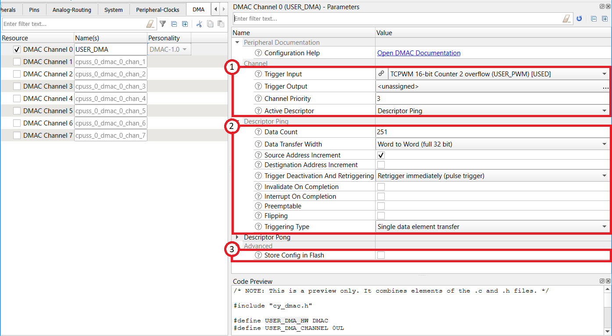
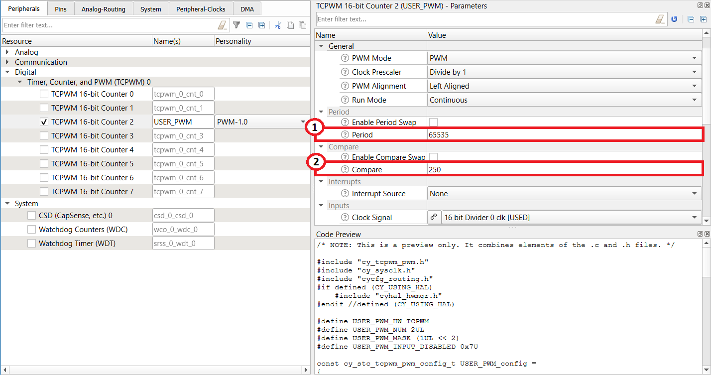
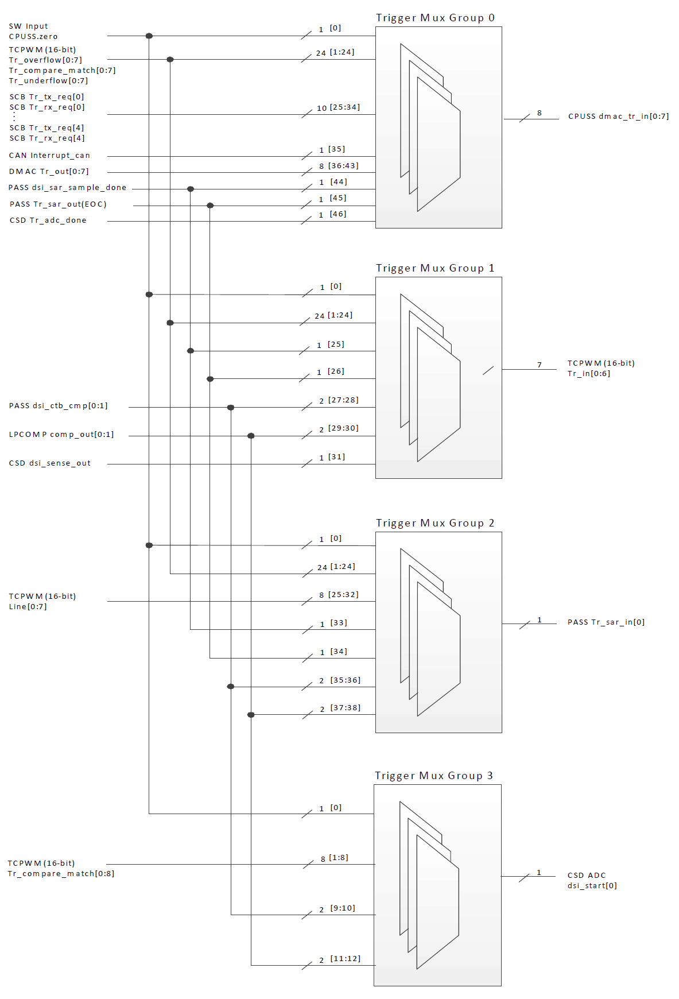

# PSOC&trade; 4: PWM triggering a DMA channel

This example demonstrates how to route trigger signals on a PSOC&trade; 4 MCU. The trigger signal in this code example is routed from the pulse width modulation (PWM) to direct memory access (DMA) using the device configurator.


[View this README on GitHub.](https://github.com/Infineon/mtb-example-psoc4-pwm-trigger-dma)

[Provide feedback on this code example.](https://yourvoice.infineon.com/jfe/form/SV_1NTns53sK2yiljn?Q_EED=eyJVbmlxdWUgRG9jIElkIjoiQ0UyMzE3MzIiLCJTcGVjIE51bWJlciI6IjAwMi0zMTczMiIsIkRvYyBUaXRsZSI6IlBTT0MmdHJhZGU7IDQ6IFBXTSB0cmlnZ2VyaW5nIGEgRE1BIGNoYW5uZWwiLCJyaWQiOiJhcnBpdC5zcml2YXN0YXZAaW5maW5lb24uY29tIiwiRG9jIHZlcnNpb24iOiIyLjUuMCIsIkRvYyBMYW5ndWFnZSI6IkVuZ2xpc2giLCJEb2MgRGl2aXNpb24iOiJNQ0QiLCJEb2MgQlUiOiJJQ1ciLCJEb2MgRmFtaWx5IjoiUFNPQyJ9)


## Requirements


- [ModusToolbox&trade;](https://www.infineon.com/modustoolbox) v3.7 or later (tested with v3.7)
- Board support package (BSP) minimum required version: 3.1.0
- Programming language: C
- Associated parts: [PSOC&trade; 4100S Plus, PSOC&trade; 4500S PSOC&trade; 4100S Max, PSOC&trade; 4100T Plus](https://www.infineon.com/cms/en/product/microcontroller/32-bit-psoc-arm-cortex-microcontroller/psoc-4-32-bit-arm-cortex-m0-mcu/) and [ PSOC&trade; 4 HV (High Voltage)](https://www.infineon.com/cms/en/product/microcontroller/32-bit-psoc-arm-cortex-microcontroller/32-bit-psoc-4-hv-arm-cortex-m0/)


## Supported toolchains (make variable 'TOOLCHAIN')

- GNU Arm&reg; Embedded Compiler v14.2.1 (`GCC_ARM`) – Default value of `TOOLCHAIN`
- Arm&reg; Compiler v6.22 (`ARM`)
- IAR C/C++ Compiler v9.50.2 (`IAR`)


## Supported kits (make variable 'TARGET')

- [PSOC&trade; 4100S Max Pioneer Kit](https://www.infineon.com/CY8CKIT-041S-MAX) (`CY8CKIT-041S-MAX`) - Default value of `TARGET`
- [PSOC&trade; 4100S Plus Prototyping Kit](https://www.infineon.com/CY8CKIT-149) (`CY8CKIT-149`)
- [PSOC&trade; 4500S Pioneer Kit](https://www.infineon.com/CY8CKIT-045S) (`CY8CKIT-045S`)
- [PSOC&trade; 4100T Plus CAPSENSE&trade; Prototyping Kit](https://www.infineon.com/CY8CPROTO-041TP) (`CY8CPROTO-041TP`)
- [PSOC&trade; 4 HVMS-128K Evaluation Kit](https://www.infineon.com/cms/en/product/evaluation-boards/kit_psoc4-hvms-128k_lite/) (`KIT_PSOC4-HVMS-128K_LITE`)
- [PSOC&trade; 4 HVMS-64K Evaluation Kit](https://www.infineon.com/cms/en/product/evaluation-boards/kit_psoc4-hvms-64k_lite/) (`KIT_PSOC4-HVMS-64K_LITE`)
- [PSOC&trade; 4 HVPA-144K Evaluation Kit](https://www.infineon.com/cms/en/product/evaluation-boards/kit_psoc4-hvpa-144k_lite/) (`KIT_PSOC4-HVPA-144K_LITE`)
- [PSOC&trade; 4 HVPA-SPM 1.0 Evaluation Kit](https://www.infineon.com/design-resources/finder-selection-tools/evaluation-board) (`KIT_PSOC-HVPA-SPM1_LITE`)

## Hardware setup

This example uses the board's default configuration. See the kit user guide to ensure that the board is configured correctly.


> **Note:** Some PSOC&trade; 4 kits ship with KitProg2 installed. ModusToolbox&trade; requires KitProg3. Before using this code example, make sure that the board is upgraded to KitProg3. The tool and instructions are available in the [Firmware Loader](https://github.com/Infineon/Firmware-loader) GitHub repository. If you do not upgrade, you will see an error like "unable to find CMSIS-DAP device" or "KitProg firmware is out of date".


## Software setup

See the [ModusToolbox&trade; tools package installation guide](https://www.infineon.com/ModusToolboxInstallguide) for information about installing and configuring the tools package.

This example requires no additional software or tools.


## Using the code example


### Create the project

The ModusToolbox&trade; tools package provides the Project Creator as both a GUI tool and a command line tool.

<details><summary><b>Use Project Creator GUI</b></summary>

1. Open the Project Creator GUI tool

   There are several ways to do this, including launching it from the dashboard or from inside the Eclipse IDE. For more details, see the [Project Creator user guide](https://www.infineon.com/ModusToolboxProjectCreator) (locally available at *{ModusToolbox&trade; install directory}/tools_{version}/project-creator/docs/project-creator.pdf*)

2. On the **Choose Board Support Package (BSP)** page, select a kit supported by this code example. See [Supported kits](#supported-kits-make-variable-target)

   > **Note:** To use this code example for a kit not listed here, you may need to update the source files. If the kit does not have the required resources, the application may not work

3. On the **Select Application** page:

   a. Select the **Applications(s) Root Path** and the **Target IDE**

      > **Note:** Depending on how you open the Project Creator tool, these fields may be pre-selected for you

   b. Select this code example from the list by enabling its check box

      > **Note:** You can narrow the list of displayed examples by typing in the filter box

   c. (Optional) Change the suggested **New Application Name** and **New BSP Name**

   d. Click **Create** to complete the application creation process

</details>


<details><summary><b>Use Project Creator CLI</b></summary>

The 'project-creator-cli' tool can be used to create applications from a CLI terminal or from within batch files or shell scripts. This tool is available in the *{ModusToolbox&trade; install directory}/tools_{version}/project-creator/* directory.

Use a CLI terminal to invoke the 'project-creator-cli' tool. On Windows, use the command-line 'modus-shell' program provided in the ModusToolbox&trade; installation instead of a standard Windows command-line application. This shell provides access to all ModusToolbox&trade; tools. You can access it by typing "modus-shell" in the search box in the Windows menu. In Linux and macOS, you can use any terminal application.

The following example clones the "mtb-example-psoc4-pwm-trigger-dma" application with the desired name "Psoc4TriggerDma" configured for the CY8CKIT-149 BSP into the specified working directory, *C:/mtb_projects:*

   ```
   project-creator-cli --board-id CY8CKIT-149 --app-id mtb-example-psoc4-pwm-trigger-dma --user-app-name Psoc4TriggerDma --target-dir "C:/mtb_projects"
   ```

The 'project-creator-cli' tool has the following arguments:

Argument | Description | Required/optional
---------|-------------|-----------
`--board-id` | Defined in the <id> field of the [BSP](https://github.com/Infineon?q=bsp-manifest&type=&language=&sort=) manifest | Required
`--app-id`   | Defined in the <id> field of the [CE](https://github.com/Infineon?q=ce-manifest&type=&language=&sort=) manifest | Required
`--target-dir`| Specify the directory in which the application is to be created if you prefer not to use the default current working directory | Optional
`--user-app-name`| Specify the name of the application if you prefer to have a name other than the example's default name | Optional

<br>

> **Note:** The project-creator-cli tool uses the `git clone` and `make getlibs` commands to fetch the repository and import the required libraries. For details, see the "Project creator tools" section of the [ModusToolbox&trade; tools package user guide](https://www.infineon.com/ModusToolboxUserGuide) (locally available at {ModusToolbox&trade; install directory}/docs_{version}/mtb_user_guide.pdf).

</details>


### Open the project

After the project has been created, you can open it in your preferred development environment.


<details><summary><b>Eclipse IDE</b></summary>

If you opened the Project Creator tool from the included Eclipse IDE, the project will open in Eclipse automatically.

For more details, see the [Eclipse IDE for ModusToolbox&trade; user guide](https://www.infineon.com/MTBEclipseIDEUserGuide) (locally available at *{ModusToolbox&trade; install directory}/docs_{version}/mt_ide_user_guide.pdf*).

</details>


<details><summary><b>Visual Studio (VS) Code</b></summary>

Launch VS Code manually, and then open the generated *{project-name}.code-workspace* file located in the project directory.

For more details, see the [Visual Studio Code for ModusToolbox&trade; user guide](https://www.infineon.com/MTBVSCodeUserGuide) (locally available at *{ModusToolbox&trade; install directory}/docs_{version}/mt_vscode_user_guide.pdf*).

</details>


<details><summary><b>Arm&reg; Keil&reg; µVision&reg;</b></summary>

Double-click the generated *{project-name}.cprj* file to launch the Keil&reg; µVision&reg; IDE.

For more details, see the [Arm&reg; Keil&reg; µVision&reg; for ModusToolbox&trade; user guide](https://www.infineon.com/MTBuVisionUserGuide) (locally available at *{ModusToolbox&trade; install directory}/docs_{version}/mt_uvision_user_guide.pdf*).

</details>


<details><summary><b>IAR Embedded Workbench</b></summary>

Open IAR Embedded Workbench manually, and create a new project. Then select the generated *{project-name}.ipcf* file located in the project directory.

For more details, see the [IAR Embedded Workbench for ModusToolbox&trade; user guide](https://www.infineon.com/MTBIARUserGuide) (locally available at *{ModusToolbox&trade; install directory}/docs_{version}/mt_iar_user_guide.pdf*).

</details>


<details><summary><b>Command line</b></summary>

If you prefer to use the CLI, open the appropriate terminal, and navigate to the project directory. On Windows, use the command-line 'modus-shell' program; on Linux and macOS, you can use any terminal application. From there, you can run various `make` commands.

For more details, see the [ModusToolbox&trade; tools package user guide](https://www.infineon.com/ModusToolboxUserGuide) (locally available at *{ModusToolbox&trade; install directory}/docs_{version}/mtb_user_guide.pdf*).

</details>


## Operation


In this example, the intensity of the LED is controlled by changing the duty cycle of the PWM signal. The PWM duty cycle is updated using DMA. The duty cycle is updated in such a way that a breathing pattern is seen on the LED.

1. Connect the board to your PC using the provided USB cable through the USB connector

2. Program the board using one of the following:

   <details><summary><b>Using Eclipse IDE</b></summary>

      1. Select the application project in the Project Explorer

      2. In the **Quick Panel**, scroll down, and click **\<Application Name> Program (KitProg3_MiniProg4)**
   </details>


   <details><summary><b>In other IDEs</b></summary>

   Follow the instructions in your preferred IDE

   </details>


   <details><summary><b>Using CLI</b></summary>

     From the terminal, execute the `make program` command to build and program the application using the default toolchain to the default target. The default toolchain is specified in the application's Makefile but you can override this value manually:
      ```
      make program TOOLCHAIN=<toolchain>
      ```

      Example:
      ```
      make program TOOLCHAIN=GCC_ARM
      ```
   </details>

3. See the breathing output on the user LED


## Debugging

You can debug the example to step through the code.


<details><summary><b>In Eclipse IDE</b></summary>

Use the **\<Application Name> Debug (KitProg3_MiniProg4)** configuration in the **Quick Panel**. For details, see the "Program and debug" section in the [Eclipse IDE for ModusToolbox&trade; user guide](https://www.infineon.com/MTBEclipseIDEUserGuide).

</details>


<details><summary><b>In other IDEs</b></summary>

Follow the instructions in your preferred IDE.

</details>


## Design and implementation

PSOC&trade; 4  has many digital signals generated from different peripheral blocks. Many of these signals need to be routed to other peripheral blocks as triggers to some events there. Trigger multiplexers are simple multiplexers designed to route these signals from potential source peripherals to destinations. This example demonstrates setting up a trigger route from PWM to DMA.

The design implements a PWM with a duty cycle updated on every terminal count of the PWM through a DMA. A preset list of compare values are kept in an array. These preset compare values are in a format that, when updated as the compare value of the PWM in every cycle, generates a breathing pattern. The array with compare values is the source of data transfer for the DMA; the destination is the PWM’s compare register. The DMA is triggered using the PWM’s terminal count signal. The routing of the terminal count signal to the trigger input of the DMA is accomplished using the trigger multiplexer.

You need to connect the PWM overflow trigger (ovrflw) to the DMA input trigger (tr_in). The ModusToolbox&trade; software device configurator  takes care of generating the code responsible for routing the trigger signal. See [Trigger multiplexer](#trigger-multiplexer) for details.


### Resources and settings

**Table 1. Application resources**

 Resource  |  Alias/object     |    Purpose
 :-------- | :-------------    | :------------
 TCPWM (PWM)       | USER_PWM         | PWM to drive the user LED
 DMA               | USER_DMA         | DMA channel to update the PWM compare value
 GPIO              | CYBSP_USER_LED1   | LED to show the output

<br>


## Resource settings


### DMA configuration

A DMA channel is used to transfer the compare values from the array to the PWM compare register. The configuration is shown in **Figure 1**.

**Figure 1. DMA configuration**



The trigger input to the DMA is connected to the PWM overflow trigger output. The trigger output is not used. Descriptor Ping is retained as the active descriptor.

The DMA implements a simple array to a single register transfer, which can be achieved using a single descriptor. Only the ping descriptor is required in this case. This descriptor transfers a 251-element array to a single compare register over 251 triggers. Therefore, the data count is set as 251. Because the data source is an array, the address needs to be incremented after each transfer. Therefore, the source address increment is set. The destination is a constant compare register. Therefore, destination increment is not set.

The ping descriptor source and destinations are dynamically updated in the code. Hence, it is not stored in flash.


### TCPWM configuration

**Figure 2. TCPWM configuration**



The period value of the PWM is set to 65532. The PWM is clocked by a 12 MHz clock and the terminal count is used to trigger the DMA. This period value (65532) ensures that the terminal count, and consequently the DMA trigger, occurs at a frequency of 12/65532 MHz. The breathing rate of the LED is determined by this rate of DMA trigger multiplied by the number of elements in the array of compared values.

The compare value is set to 256 here. However, the compare value is updated later using this DMA. Therefore, this value starts the PWM at a very small duty cycle.


## Trigger multiplexer

The DMA channels can have trigger inputs from different peripheral sources in the PSOC&trade; device. This is routed to the individual DMA channel trigger inputs through the trigger multiplexer. In the DMA trigger, multiplexers are organized into trigger groups. Each trigger group is composed of multiple multiplexers feeding into the individual DMA channel trigger inputs.

The routing of the trigger is achieved by configuring a single trigger group (Trigger group 0), which provides trigger inputs to the DMA.

**Figure 3. Trigger multiplexer architecture**



ModusToolbox&trade; device configurator automatically generates the code required to trigger multiplexer routing. This trigger multiplexer routing code is in *cycfg_routing.c* as part of the `cybsp_init()` function. The following code snippet is from the `cybsp_init()` function of this code example; it shows the `Cy_TrigMux_Connect()` call to connect the PWM overflow output trigger to the DMA input trigger.

```c
Cy_TrigMux_Connect(TRIG0_IN_TCPWM_TR_OVERFLOW2, TRIG0_OUT_CPUSS_DMAC_TR_IN0);
```


## Related resources

Resources  | Links
-----------|----------------------------------
Application notes  | [AN79953](https://documentation.infineon.com/psoc4000t/docs/xim1745489334160) – Getting started with PSOC&trade; 4<br>[AN0034](https://www.infineon.com/row/public/documents/10/42/infineon-an0034-getting-started-with-psoc-4-hv-ms-mcus-in-modustoolbox-applicationnotes-en.pdf) - Getting started with PSOC&trade; 4 HV MS and PSOC&trade; 4 HV PA MCUs in ModusToolbox&trade;
Code examples  | [Using ModusToolbox&trade;](https://github.com/Infineon/Code-Examples-for-ModusToolbox-Software) on GitHub
Device documentation |[PSOC&trade; 4 datasheets](https://documentation.infineon.com/psoc4/docs/qqs1702048028479) <br>[PSOC&trade; 4 technical reference manuals](https://documentation.infineon.com/psoc4/docs/hup1702048028817) <br>[PSOC&trade; 4 HV MS 64k datasheets](https://documentation.infineon.com/psoc4atv/docs/lov1747976741007) <br>[PSOC&trade; 4 HV MS 64k reference manuals](https://documentation.infineon.com/psoc4atv/docs/sfz1747976866500) <br>[PSOC&trade; 4 HV MS 128k datasheets](https://documentation.infineon.com/psoc4atv/docs/ypt1703926222536) <br>[PSOC&trade; 4 HV MS 128k reference manuals](https://documentation.infineon.com/psoc4atv/docs/fsx1703926693671) <br>[PSOC&trade; 4 HV PA datasheets](https://documentation.infineon.com/psoc4atv/docs/rsd1669346756301) <br>[PSOC&trade; 4 HV PA reference manuals](https://documentation.infineon.com/psoc4atv/docs/vkg1670389100008)
Development kits | Select your kits from the [Evaluation board finder](https://www.infineon.com/cms/en/design-support/finder-selection-tools/product-finder/evaluation-board).
Libraries on GitHub | [mtb-pdl-cat2](https://github.com/Infineon/mtb-pdl-cat2) – PSOC&trade; 4 Peripheral Driver Library (PDL)<br> [mtb-hal-cat2](https://github.com/Infineon/mtb-hal-cat2) – Hardware Abstraction Layer (HAL) library
Middleware on GitHub  |
Tools  | [ModusToolbox&trade;](https://www.infineon.com/modustoolbox) – ModusToolbox&trade; software is a collection of easy-to-use libraries and tools enabling rapid development with Infineon MCUs for applications ranging from wireless and cloud-connected systems, edge AI/ML, embedded sense and control, to wired USB connectivity using PSOC&trade; Industrial/IoT MCUs, AIROC&trade; Wi-Fi and Bluetooth&reg; connectivity devices, XMC&trade; Industrial MCUs, and EZ-USB&trade;/EZ-PD&trade; wired connectivity controllers. ModusToolbox&trade; incorporates a comprehensive set of BSPs, HAL, libraries, configuration tools, and provides support for industry-standard IDEs to fast-track your embedded application development.

<br>


## Other resources

Infineon provides a wealth of data at [www.infineon.com](https://www.infineon.com) to help you select the right device, and quickly and effectively integrate it into your design.


## Document history

Document title: *CE231732* - *PSOC&trade; 4: PWM triggering a DMA channel*

 Version | Description of change
 ------- | ---------------------
 1.0.0   | New code example
 1.1.0   | Added support for new kits
 2.0.0   | Major update to support ModusToolbox&trade; v3.0. This version is not backward compatible with previous versions of ModusToolbox&trade; software.
 2.1.0   | Added support for KIT_PSOC4-HVMS-128K_LITE and KIT_PSOC4-HVMS-64K_LITE and updated to support ModusToolbox&trade; v3.2.
 2.2.0   | Added support for CY8CPROTO-041TP and updated to support ModusToolbox&trade; v3.5. <br> Changed HVMS kit name PSoC4 to PSOC4.
 2.3.0   | Added support for KIT_PSOC4-HVMS-128K_LITE-02 and KIT_PSOC4-HVMS-64K_LITE-02 <br>
 2.4.0   | Added support for KIT_PSOC4-HVPA-144K_LITE
 2.5.0   | Added support for KIT_PSOC-HVPA-SPM1_LITE and updated to support ModusToolbox&trade; v3.7.
<br>


All referenced product or service names and trademarks are the property of their respective owners.

The Bluetooth&reg; word mark and logos are registered trademarks owned by Bluetooth SIG, Inc., and any use of such marks by Infineon is under license.

PSOC&trade;, formerly known as PSoC&trade;, is a trademark of Infineon Technologies. Any references to PSoC&trade; in this document or others shall be deemed to refer to PSOC&trade;.

---------------------------------------------------------

(c) 2020-2026, Infineon Technologies AG, or an affiliate of Infineon Technologies AG. All rights reserved.
This software, associated documentation and materials ("Software") is owned by Infineon Technologies AG or one of its affiliates ("Infineon") and is protected by and subject to worldwide patent protection, worldwide copyright laws, and international treaty provisions. Therefore, you may use this Software only as provided in the license agreement accompanying the software package from which you obtained this Software. If no license agreement applies, then any use, reproduction, modification, translation, or compilation of this Software is prohibited without the express written permission of Infineon.
<br>
Disclaimer: UNLESS OTHERWISE EXPRESSLY AGREED WITH INFINEON, THIS SOFTWARE IS PROVIDED AS-IS, WITH NO WARRANTY OF ANY KIND, EXPRESS OR IMPLIED, INCLUDING, BUT NOT LIMITED TO, ALL WARRANTIES OF NON-INFRINGEMENT OF THIRD-PARTY RIGHTS AND IMPLIED WARRANTIES SUCH AS WARRANTIES OF FITNESS FOR A SPECIFIC USE/PURPOSE OR MERCHANTABILITY. Infineon reserves the right to make changes to the Software without notice. You are responsible for properly designing, programming, and testing the functionality and safety of your intended application of the Software, as well as complying with any legal requirements related to its use. Infineon does not guarantee that the Software will be free from intrusion, data theft or loss, or other breaches (“Security Breaches”), and Infineon shall have no liability arising out of any Security Breaches. Unless otherwise explicitly approved by Infineon, the Software may not be used in any application where a failure of the Product or any consequences of the use thereof can reasonably be expected to result in personal injury.


